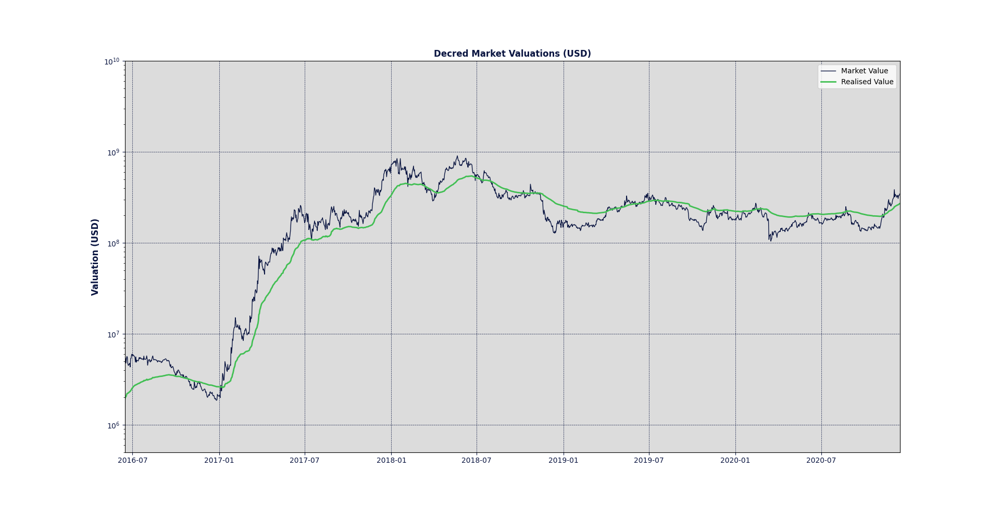
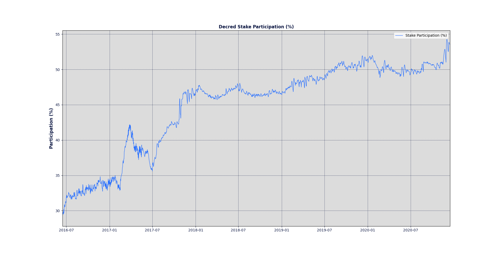
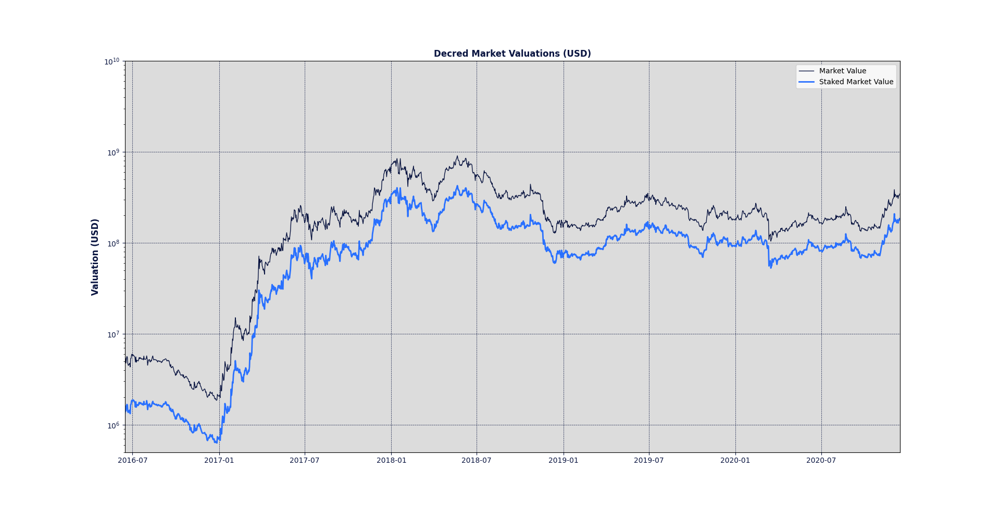
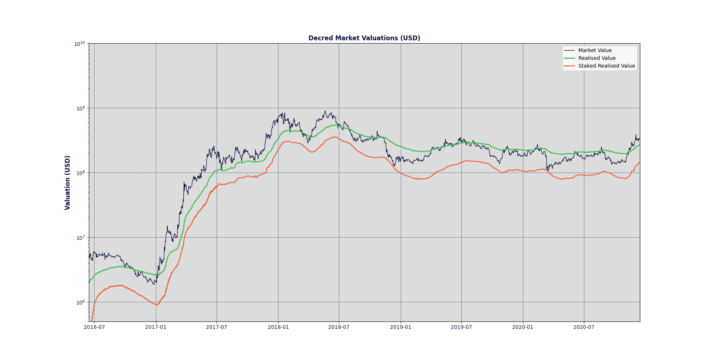
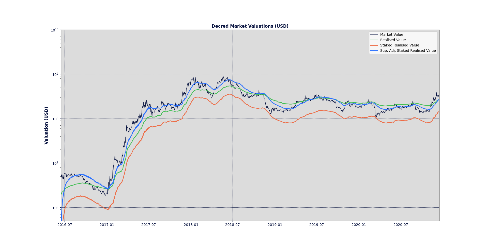
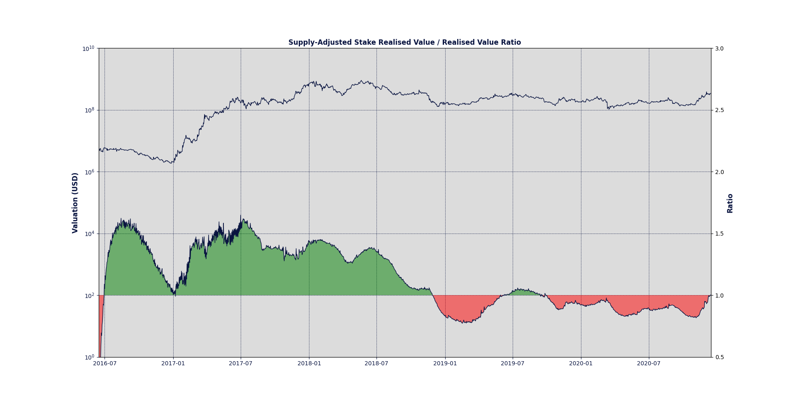

# Decred On-Chain: Stake-based Valuation Models

Obvious disclaimer, nothing of what is discussed in this article should be taken as trading or investment advice.

### Background

The following works are the basis for what is described below, consider it prior recommended reading:
* [Realised Capitalisation](https://coinmetrics.io/realized-capitalization/) by Nic Carter and Antoine Le Calvez
* [Realised Cap, MVRV ratio and Gradient Oscillators](https://medium.com/decred/decred-on-chain-realised-cap-mvrv-ratio-and-gradient-oscillators-a36ed2cc8182) by Checkmate.
*  [Ticket Pool Volume Weighted Average (TVWAP)](https://medium.com/@permabullnino/decred-on-chain-the-ticket-pool-vwap-d0a3d1c42a3) by Permabull Niño.

Defining some of the terms that are referred to throughout the rest of this post:

* **Market Value** or market capitalisation the traditional means of valuation in legacy finance, widely used as a metric for cryptocurrencies, it's calculated as `circulating supply * latest market price`.
* **Realised Value** is a valuation metric based on the cumulative sum of the price of each UTXO when it last moved.
 * **Ticket Pool Size** is the total number of Proof-of-Stake tickets in the Decred network, this size oscillates around 40,960 - which is the a target ticket pool size, a predefined network parameter.
* **Ticket Pool Value** is the total amount of DCR locked in on tickets. at a given time.

Decred's hybrid Proof-of-Work/Proof-of-Stake and ticket-based governance system is the heartbeat of the protocol, it generates a constant flow of coins that, when analysed through already established on-chain metrics, creates a differentiating imprint that makes Decred stand out when compared to other UTXO chains.  

Checkmate's article above delves deep into the Realised Value and its very unique behaviour when it comes to Decred, it acts as a kind of moving average to the Market Value, acting as support during upward trends and resistance on downward trends.

### The Ticket Pool: A Map For Stakeholder Sentiment

Given that the Decred stakeholders lock up coins for up to 142 days to stake, the ticket pool and some of the metrics that can be derived from it can provide clear signals of stakeholder commitment to participate in the governance and security of the network. A good proportion of these metrics are unique to Decred's hybrid consensus and ticketing system, as such, they cannot be compared on equal footing to any other chain out there.

The **Stake Participation** is the simplest form of these metrics, it is calculated as `Ticket Pool Value / Circulating Supply` at any given time. It's easily available as a chart on the [dcrdata.org block explorer](https://explorer.dcrdata.org/charts?chart=stake-participation&zoom=ikd7pc00-khmn2tc0&bin=day&axis=time&visibility=true-false). In simple terms, it's the percentage of supply has been locked in tickets.

Since the launch of the network, the stake participation has seen a nearly consistent uptrend, with every higher high and subsequent retracement establishing a new, higher low. The demand to participate in the governance and security of the protocol has not been fazed at all by the bear market over the past two years.

| Peak Date | Peak Stake Participation (%) | Retracement Bottom Date | Retracement Bottom Stake Participation (%) |
|--|--|--|--|
|2017-03-29|41.82%|2017-06-30|35.28%|
|2018-01-17|47.63%|2018-04-03|45.43%|
|2018-06-28|47.85%|2018-09-10|45.84%|
|2020-01-20|51.85%|2020-02-22|48.60%|

Going a step further, we can take a first stab at establishing a metric that measures valuation from the stakeholder sentiment point of view via the **Staked Market Value**, which is calculated as the `Ticket Pool Value * Latest Market Price`.

This metric gives us the current valuation of all the DCR in the ticket pool at a given time. It's an analogy to the Total Value Locked (TVL) in the decentralised finance space, a concise indicator of the current value of the capital that's been put at stake to participate in the network while earning yield.

The main disadvantage of this metric is that it weighs all of the stake at the current price, implicitly making the assumption that stakeholders are choosing to continue staking at the current valuation. In reality, stakeholders have agreed to engage in a contract, locking their coins at a specific market valuation and ticket price, expecting a yield within a certain range. Since the tickets are pseudo-randomly selected to vote, stakeholders do not have the option of withdrawing from the contract until their ticket is either called to vote or expires.

### Introducing the Staked Realised Value

The Staked Realised Value is an attempt at a more accurate valuation based on stakeholder sentiment, it's defined as the valuation of the ticket pool, measured by cost of every ticket on the day it was purchased and added to the pool. It is analogous to the Realised Value but applied exclusively to tickets, treating every ticket as a UTXO.

Assuming a hypothetical case where there are no tickets live on the network and three are purchased in consecutive days, voting a few days later in the same order:

| Ticket ID |Date Purchased  | Ticket Price (DCR)  |   Date Voted |
|--|--|--|--|
|1 |Day 1| 100 DCR | Day 11
|2 |Day 2 | 100 DCR | Day 12
|3 |Day 3 | 100 DCR | Day 13

The stake realised value would be calculated as:

 Date | DCR Price | Ticket Pool Value (DCR) | Staked Realised Value  | Net Change |  Comment
--|--|--|--|--|--|
Day 0 | 1 USD| 0 DCR |0 USD | 0 | No Change
Day 1 | 1 USD| 100 DCR |100 USD | + 100 USD| Ticket 1 Purchased
Day 2 | 2 USD| 200 DCR | 300 USD | + 200 USD | Ticket 2 Purchased
Day 3| 3 USD| 300 DCR | 600 USD | + 300 USD | Ticket 3 Purchased
Day 4| 10 USD| 300 DCR | 600 USD | 0 | No Change 
Day 11| 10 USD | 200 DCR | 500 USD | - 100 USD |  Ticket 1 Voted
Day 12| 10 USD | 100 DCR| 300 USD | - 200 USD | Ticket 2 Voted
Day 13 | 10 USD | 0 DCR | 0 USD | - 300 USD | Ticket 3 Voted
Day 14 | 10 USD | 0 DCR | 0 USD | 0 | No change

Even as the DCR/USD price rises tenfold between Day 1 and Day 4, the Staked Realised Value is still calculated on the initial capital that was locked with every ticket.

The chart below includes the Staked Realised Value alongside the Market Value and Realised Value.

The Staked Realised value behaves very much like the lower band for the Market Value. During sharp sell-offs, the value locked into governance and security of the network has acted as a psychological bottom, the point of maximum pain, where the buyers of last resort step in.

Using the Staked Realised Value as a basis, it's possible to derive a Supply-Adjusted variant that reflects the cumulative lock-in price for the coins held in the ticket pool at a given time, this is calculated as `Staked Realised Value * (Circulating Supply / Ticket Pool Value)`. 
  

The **Supply-Adjusted Staked Realised Value** behaves as a faster moving average than the Realised Value to the Market Value, a first line of support in bullish trends and first line of resistance in downtrends and sideways action.

The relationship between the Realised Value and the Supply-Adjusted Staked Realised Value also seenms to provide a lagging indicator of the direction that the market is trending, this is better visualised by constructing an oscilator based on the ratio between these two metrics. The **SASRV/RV Ratio** is calculated as `Supply-Adjusted Staked Realised Value / Realised Value`. 

During the past market cycle, the SASRV/RV ratio remained above 1 throughout the entirety of the bull market, while during the bear market it has struggled to decisevely break and sustain above that value. Despite this metric crossing bullish again, I'd like to see a much stronger breakout to the upside as confirmation of what looks like an upcoming bull market kicking into full gear - something to keep an eye on over the next few weeks.

### Summary

While DCR is relatively nascent as a tradeable asset, with a single market cycle under it's belt, the data available so far makes a compelling case to dive deeper into the on-chian behaviour that is unique to the hybrid PoW/PoS consensus. The Staked Realised Value and it's supply-adjusted variant are complementary valuation tools to other existing metrics, enabling the gauging of key psychological levels for stakeholders - who are, after all, the largest key players in the protocol.
